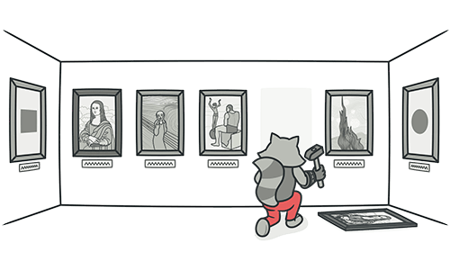
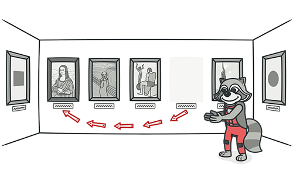

# Codigo Duplicado (Duplicate Code)

## Síntomas y signos

Dos fragmentos de código parecen casi idénticos

## Razones del problema

La duplicación suele ocurrir cuando varios programadores trabajan en diferentes partes del mismo programa al mismo tiempo. Dado que están trabajando en tareas diferentes, pueden no ser conscientes de que su colega ya ha escrito código similar que podría reutilizarse para sus propias necesidades.

También existe una duplicación más sutil, cuando partes específicas del código parecen diferentes, pero en realidad realizan el mismo trabajo. Este tipo de duplicación puede ser difícil de detectar y solucionar.

A veces, la duplicación es intencional. Cuando se está apurado por cumplir plazos y el código existente es "casi correcto" para el trabajo, los programadores novatos pueden no resistir la tentación de copiar y pegar el código relevante. Y en algunos casos, el programador simplemente es demasiado perezoso para despejar el código.

## Tratamiento

- Si se encuentra el mismo código en dos o más métodos dentro de la misma clase: se debe utilizar la técnica de refactorización [Método de extracción](.././RefactoringPattern/ExtractMethod.md) y colocar llamadas al nuevo método en ambos lugares.

- Si se encuentra el mismo código en dos subclases del mismo nivel:

  - Utilice la técnica de refactorización [Método de extracción](.././RefactoringPattern/ExtractMethod.md) para ambas clases, seguida de [Quitar campo](.././RefactoringPattern/PullUpField.md) para los campos utilizados en el método que se está extrayendo.

  - Si el código duplicado está dentro de un constructor, utilice [Quitar contructor](.././RefactoringPattern/PullUpConstructorBody.md).

  - Si el código duplicado es similar pero no completamente idéntico, utilice [Método de plantilla de formulario](.././RefactoringPattern/FormTemplateMethod.md).

  - Si dos métodos hacen lo mismo pero usan diferentes algoritmos, seleccione el mejor algoritmo y aplique [Algoritmo de sustitución](.././RefactoringPattern/SubstituteAlgorithm.md).

- Si se encuentra código duplicado en dos clases diferentes:

  - Si las clases no forman parte de una jerarquía, se debe utilizar la técnica de refactorización [Extraer superclase](.././RefactoringPattern/ExtractSuperclass.md) para crear una superclase única para estas clases que mantenga toda la funcionalidad anterior.

  - Si es difícil o imposible crear una superclase, se debe utilizar [Extraer clase](.././RefactoringPattern/ExtractClass.md) en una de las clases y utilizar el nuevo componente en la otra.

- Si hay un gran número de expresiones condicionales presentes y realizan el mismo código (diferenciándose solo en sus condiciones), se debe utilizar la técnica de refactorización [Consolidar Expresión Condicional](.././RefactoringPattern/ConsolidateConditionalExpression.md) para fusionar estos operadores en una sola condición y utilizar [Método de extracción](.././RefactoringPattern/ExtractMethod.md) para colocar la condición en un método separado con un nombre fácil de entender.

- Si el mismo código se realiza en todas las ramas de una expresión condicional: se debe colocar el código idéntico fuera del árbol de condición utilizando la técnica de refactorización [Consolidar fragmentos condicionales duplicados](.././RefactoringPattern/ConsolidateDuplicateConditionalFragments.md).

Estas técnicas de refactorización pueden ser útiles para simplificar y optimizar el código que contiene muchas expresiones condicionales y mejorar su legibilidad y mantenibilidad.

## Recompensa

- La fusión de código duplicado simplifica la estructura del código y lo hace más corto.

- Simplificación + brevedad = código más fácil de simplificar y más económico de mantener.

## Cuando Ignorar

En casos muy raros, fusionar dos fragmentos idénticos de código puede hacer que el código sea menos intuitivo y obvio.