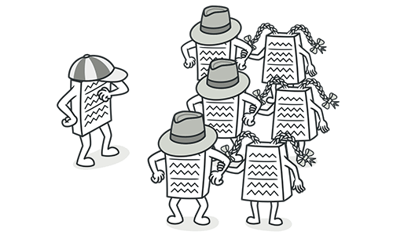

# Intermediarios (Middle Man)

## Síntomas y signos

Si una clase realiza solo una acción, delegando el trabajo a otra clase, entonces ¿por qué existe?

)

## Razones del problema

Este Code Smell puede ser el resultado de la eliminación excesiva de las [cadenas de mensajes](./CodeSmell/MessageChains.md).

En otros casos, puede ser el resultado del trabajo útil de una clase que se mueve gradualmente a otras clases.
La clase permanece como una cáscara vacía que no hace otra cosa que delegar.

## Tratamiento

Si la mayoría de las clases de un método delegan a otra clase, [Eliminar intermediario](/RefactoringPattern/RemoveMiddleMan.md) está entre ellos.

## Recompensa

El código se vuelve menos voluminoso.

## Cuando ignorar

No elimine los intermediarios que se hayan creado por estos motivos:

Si se ha agregado un intermediario para evitar dependencias entre clases.

Algunos patrones de diseño crean intermediarios a propósito (como [Proxy](https://refactoring.guru/design-patterns/proxy) o [Decorator](https://refactoring.guru/design-patterns/decorator)).