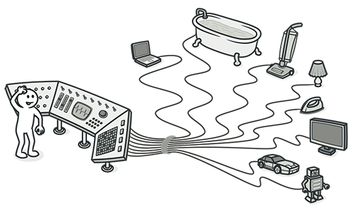

# Sentencias switch
## Signos y Síntomas

Tienes un operador `switch` complejo o una secuencia de declaraciones `if`.

## Razones del problema
El uso relativamente poco frecuente de los operadores `switch` y `case` es una de las características distintivas del código orientado a objetos. A menudo, el código para un solo `switch` puede estar disperso en diferentes lugares del programa. Cuando se agrega una nueva condición, es necesario encontrar todo el código del `switch` y modificarlo.

Como regla general, cuando veas un `switch`, deberías pensar en polimorfismo.

## Tratamiento
· Para aislar el `switch` y colocarlo en la clase correcta, es posible que necesites utilizar [Extract Method](../RefactoringPattern/ExtractMethod.md) y luego [Move Method.](../RefactoringPattern/MoveMethod.md)

· Si un `switch` se basa en un código de tipo, como cuando se cambia el modo de ejecución del programa, utiliza [Replace Type Code with Subclasses](../RefactoringPattern/ReplaceTypeCodewithSubclasses.md) o [Replace Type Code with State/Strategy.](../RefactoringPattern/ReplaceTypeCodeWithStateStrategy.md)

· Después de especificar la estructura de herencia, utiliza [Replace Conditional with Polymorphism.](../RefactoringPattern/ReplaceConditionalwithPolymorphism.md)

· Si no hay demasiadas condiciones en el operador y todas llaman al mismo método con diferentes parámetros, el polimorfismo será superfluo. En este caso, puedes dividir ese método en varios métodos más pequeños con [Replace Parameter with Explicit Methods](../RefactoringPattern/ReplaceParameterWithExplicitMethods.md) y cambiar el `switch` en consecuencia.

· Si una de las opciones condicionales es `null`, utiliza [Introduce Null Object.](../RefactoringPattern/IntroduceNullObject.md)

## Beneficios
Mejora de la organización del código.

## Cuándo ignorar
Cuando un operador `switch` realiza acciones simples, no hay razón para realizar cambios en el código.

A menudo, los operadores `switch` se utilizan en patrones de diseño de fábrica ([Factory Method](https://refactoring.guru/es/design-patterns/factory-method) o [Abstract Factory](https://refactoring.guru/es/design-patterns/abstract-factory)) para seleccionar una clase creada.