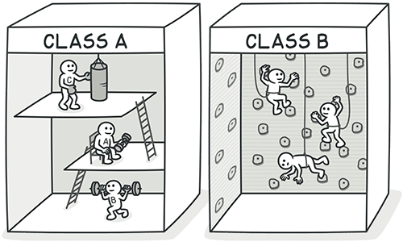

# Campo Temporal (Temporary Field)
## Signos y Síntomas
Los campos temporales obtienen sus valores (y por lo tanto son necesarios para los objetos) solo en determinadas circunstancias. Fuera de estas circunstancias, están vacíos.

## Razones del Problema
Muchas veces, los campos temporales se crean para su uso en un algoritmo que requiere una gran cantidad de entradas. En lugar de crear una gran cantidad de parámetros en el método, el programador decide crear campos para estos datos en la clase. Estos campos se utilizan solo en el algoritmo y no se utilizan el resto del tiempo.

Este tipo de código es difícil de entender. Se espera ver datos en los campos del objeto, pero por alguna razón casi siempre están vacíos.

## Tratamiento
- Los campos temporales y todo el código que opera en ellos se pueden colocar en una clase separada mediante [Extraer Método](../RefactoringPattern/ExtractMethod.md). En otras palabras, estás creando un objeto de método, logrando el mismo resultado que si realizaras [Reemplazar método con objeto de método](../RefactoringPattern/ReplaceMethodWithMethodObject.md).
- **[Introduce Null Object](/RefactoringPattern/IntroduceNullObject.md)** e intégralo en lugar del código condicional que se utilizaba para verificar la existencia de los valores de los campos temporales.

- 

## Beneficios

Mejora la claridad y organización del código. 
