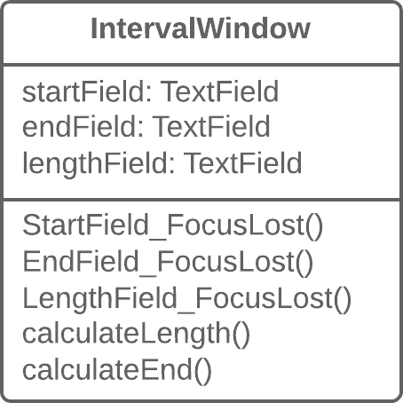

# Datos observados duplicados

## Problema
¿Los datos de dominio se almacenan en clases responsables de la GUI?

## Solución
Entonces es una buena idea separar los datos en clases separadas, asegurando la conexión y sincronización entre la clase de dominio y la GUI. 

## Por qué refactorizar
Desea tener múltiples vistas de interfaz para los mismos datos (por ejemplo, tiene una aplicación de escritorio y una aplicación móvil). Si no puede separar la GUI del dominio, tendrá muchas dificultades para evitar la duplicación de código y una gran cantidad de errores.

## Beneficios
- Divide la responsabilidad entre las clases de lógica y las clases de presentación (cf. el _Principio de Responsabilidad Única_), lo que hace que su programa sea más legible y comprensible.

- Si necesita agregar una nueva vista de interfaz, cree nuevas clases de presentación; no necesita tocar el código de la lógica (consulte el _Principio Abierto/Cerrado_).

- Ahora diferentes personas pueden trabajar en la lógica y las interfaces de usuario.

## Cuándo no usar
- Esta técnica de refactorización, que en su forma clásica se realiza mediante la plantilla de [**Observer**](https://refactoring.guru/es/design-patterns/observer), no se aplica a las aplicaciones web, donde todas las clases se recrean entre consultas al servidor web.

- De todos modos, el principio general de extraer la lógica empresarial en clases separadas también se puede justificar para las aplicaciones web. Pero esto se implementará usando diferentes técnicas de refactorización dependiendo de cómo esté diseñado su sistema.

## Cómo refactorizar
1. Oculte el acceso directo a los datos del dominio en la _clase GUI_. Para esto, es mejor usar **[Autoencapsular Campo](/RefactoringPattern/SelfEncapsulatedField.md)**. Así que crea los getters y setters para estos datos.

2. En los controladores para eventos de _clase GUI_, use setters para establecer nuevos valores de campo. Esto le permitirá pasar estos valores al objeto de _dominio_ asociado.

3. Cree una clase de dominio y copie los campos necesarios de la _clase GUI_. Cree getters y setters para todos estos campos.

4. Cree un patrón de observador para estas dos clases:

   - En la _clase de dominio_, cree una matriz para almacenar objetos de observador (_objetos GUI_), así como métodos para registrarlos, eliminarlos y notificarlos.

   - En la _clase GUI_, cree un campo para almacenar referencias a la clase de _dominio_, así como al método `update()`, que reaccionará a los cambios en el objeto y actualizará los valores de los campos en la _clase GUI_. Tenga en cuenta que las actualizaciones de valores deben establecerse directamente en el método para evitar la recurrencia.

   - En el constructor de _clases de GUI_, cree una instancia de _clase de dominio_ y guárdela en el campo que ha creado. Registre el _objeto GUI_ como observador en el _objeto de dominio_.

    - En los campos setters de _clase de dominio_, llame al método para notificar al observador (en otras palabras, método para actualizar en la _clase GUI_), para pasar los nuevos valores a la GUI.

    - Cambie los setters de los campos de _clase de GUI_ para que establezcan nuevos valores en el objeto de dominio directamente. Tenga cuidado para asegurarse de que los valores no se establezcan a través de un setter de _clase de dominio_; de lo contrario, se producirá una recursividad infinita.

## Implementa el patrón de diseño.
[**Observador**](https://refactoring.guru/es/design-patterns/observer)

## Elimina el olor
[Clase grande](/CodeSmell/LargeClass.md)