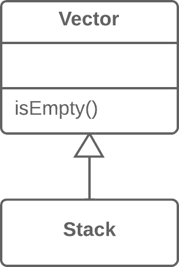

# Replace Inheritance with Delegation

## Problema

Tienes una subclase que solo usa una parte de los métodos de su superclase (o no es posible heredar los datos de la superclase).

## Solución
Crea un campo y pon un objeto de la superclase en él, delega los métodos al objeto de la superclase y elimina la herencia.

## Por qué refactorizar
Reemplazar la herencia con la composición puede mejorar sustancialmente el diseño de la clase si:

- Tu subclase viola el principio de sustitución de Liskov, es decir, si la herencia se implementó solo para combinar
código común, pero no porque la subclase sea una extensión de la superclase.

- La subclase solo usa una parte de los métodos de la superclase. En este caso, es solo cuestión de tiempo antes de 
que alguien llame a un método de la superclase que no debía llamar.

En esencia, esta técnica de refactorización divide ambas clases y hace que la superclase sea el ayudante de la 
subclase, no su padre. En lugar de heredar todos los métodos de la superclase, la subclase solo tendrá los métodos 
necesarios para delegar en los métodos del objeto de la superclase.

## Beneficios
Una clase no contiene ningún método innecesario heredado de la superclase.

Se pueden colocar diversos objetos con diversas implementaciones en el campo de delegado. En efecto,
se obtiene el patrón de diseño de [Estrategia](https://refactoring.guru/es/design-patterns/strategy).

## Desventajas
Debes escribir muchos métodos de delegación simples.

## Cómo refactorizar
1. Crea un campo en la subclase para contener la superclase. Durante la etapa inicial, coloca el objeto actual en él.

2. Cambia los métodos de la subclase para que usen el objeto de la superclase en lugar de `esto`.

3. Para los métodos heredados de la superclase que se llaman en el código del cliente, crea métodos de delegación 
simples en la subclase.

4. Elimina la declaración de herencia de la subclase.

5. Cambia el código de inicialización del campo en el que se almacena la antigua superclase creando un nuevo objeto.
